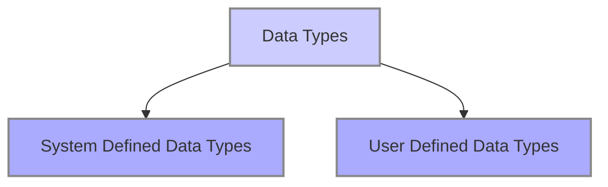

> [!content]
> 
> **Variables:**
> Named Storage Locations that hold values or data.
> 
> **Constants:**
> Immutable Named Storage Locations that hold values or data. Unlike variables constants remain unmodified throughout their scope of existence.
> 
> **Data Type:**
> Classification of values that tells the computer how to represent the data

> [!my-definition-callout] Data structures
> 
> Specialised formats for organising, processing, retrieving, and storing data defining the relationship between data and the operations that can be performed on the data.
> 
> - _Linear Data Structures:_ Elements are accessible in sequential order but may or may not be stored in sequential order. Array, List, Stack, Queue, ...
> - _Non Linear Data Structures:_ Elements are stored and accessible in non-linear order. Tree, Graph, ...
>
> _Commonly used Data Structures:_
> 
> - Arrays
> - Linked Lists
> - Linked List based Stack,
> - Array based Stack and more ...

> [!my-definition-callout] Abstract Data Types
> 
> - A conceptual model for Data Structures defining the type of data stored, the operations supported on them, and the types of parameters of the operations, without specifying how these operations are implemented or how data is organised in memory.
> 
> _Commonly used ADTs:_
> 
> - Linked Lists
> - Stacks
> - Queues
> - Binary Trees
> - Priority Queues
> - Dictionaries
> - Disjoined Sets
> - Hash Tables, and more ...

> [!Question]- How do Data Structures and Abstract Data Types relate to each other?
> **Answer:**
>
> Similarities Between Abstract Data Types (ADTs) and Data Structures
>
> - Both are used to represent and organise data.
> - Both define operations that can be performed on the data (e.g., insertion, deletion, searching).
> - Both are fundamental building blocks in computer science for designing and implementing algorithms.
>
> Differences Between Abstract Data Types (ADTs) and Data Structures.
>
> | **Feature**        | **Abstract Data Type (ADT)**   | **Data Structure**                                    |
> |:---------------|:---------------------------|:--------------------------------------------------|
> | _**Focus**_          | What it does (operations)  |How it's implemented (representation)              |
> | _**Level**_          | High-level, conceptual     |Low-level, concrete                                |
> | _**Implementation**_ | No specific implementation |Specific implementation (e.g., array, linked list) |
> | _**Example**_        | Stack (push, pop)          |Array-based Stack, Linked List-based Stack         |

> [!NOTE]
>
> A single ADT can have multiple data structure implementations, allowing for flexibility in choosing the most suitable representation for a given problem.

---
---

> [!Info]- References & MetaData Information
>
> Created On: 08 February 2025
>
> Status: #baby
>
> Keywords: #DataStructures #AbstractDataTypes #Algorithm #RuntimeAnalysis
>
> Tags: [[4 Indexes/DSA - Narasimha Karumanchi|DSA - Narasimha Karumanchi]]

---
---

[//]: # (These are reference links used in the body of this note and get stripped out when the markdown processor does its job. There is no need to format nicely because it shouldn't be seen. Thanks SO - http://stackoverflow.com/questions/4823468/store-comments-in-markdown-syntax)
