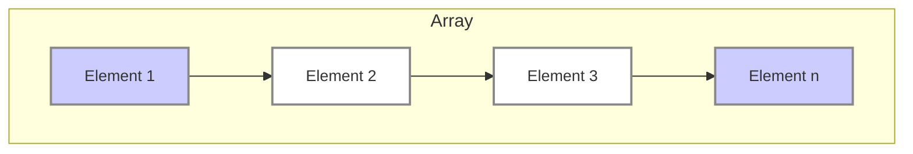
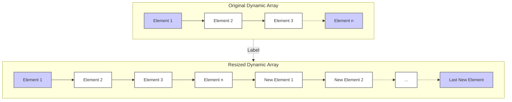

> [!my-definition-callout] Array
> 
> Fundamental data structure that organises elements of the same type into a contiguous block of memory.
> (or)
> A data structure that stores a collection of elements of the *same data type* in contiguous memory locations.

> [!NOTE] Key Concepts
> 
> - *Homogeneous Elements:* All elements must be of same DataType
> - *Contiguous Memory:* Elements are stored in *consecutive memory locations* for sequential access.
> - *Fixed Size (Usually):* One *single block of memory* is allocated to the array initially.
> 	- *Dynamic arrays* (also called *resizable arrays* or *growable arrays*) solve size limitation by automatically allocating more memory when needed, but this can have performance implications.
> - *Exception:* some languages have dynamic arrays that can resize.
> - *Index access:* Each element is identified by an index allowing fast and direct access.

> [!NOTE] Advantages and Disadvantages
> 
> **Advantages of Arrays:**
> 
> - *Fast Access:* Accessing elements by index is very fast (constant time, O(1)).
> - *Simple to Implement:* Arrays are relatively straightforward to understand and implement.
> - *Memory Efficiency (Generally):* Contiguous storage can be memory-efficient, especially if you know the size in advance.
> 
> ---
> 
> **Disadvantages of Arrays:**
> 
> - *Fixed Size (Often):* The size of the array is static (specify the array size or capacity before using it).
> - *One block allocation:* To allocate the array itself at the beginning, sometimes it may not be possible to get the memory for the complete array
> - *Complex position-based insertion / deletion:*
> 	- Inserting or deleting elements in the middle of an array can be slow because of the need to shift other elements to maintain the contiguous storage.
> 	- Inserting/deleting at the end is usually fast.
> - *Wasted Space (Potentially):* Preallocates all needed memory up front and wastes memory space for indices in the array that are empty.

> [!my-definition-callout] Dynamic Arrays
> 
> Also called *growable array*, *resizable array*, *array list*, *dynamic table*, and more
> 
> - A *random-access variable-size list data structure* that addresses the fixed-size limitation of traditional arrays.
> - It can *grow or shrink in size* as needed during the execution of a program.
> - Provides the benefits of arrays (fast access) while offering more flexibility.
> 

> [!NOTE] Key Concepts
> 
> - *Contiguous Memory (Initially):*
> 	- Like regular arrays, dynamic arrays store elements in contiguous memory locations.
> - *Automatic Resizing:* When a dynamic array becomes full and you try to add more elements, it automatically allocates a new, larger block of memory.
> 	- The existing elements are copied to this new block, and then the new element is added.
> 	- Similarly, some implementations might shrink the array if a lot of elements are removed.
> 	- While allocating New Memory, usually capacity is doubled
> 	- When number of elements is reduced by a large amount it tries to halve the capacity
> - *Capacity vs. Size:*
> 	- *Capacity:* The total number of elements the array *can* hold in its currently allocated memory.
> 	- *Size:* The number of elements the array *currently* holds.
> - *Amortized Time Complexity:*
> 	- While adding an element to a full dynamic array involves a potentially expensive resizing operation, this operation is relatively infrequent.
> 	- The *amortized* time complexity for adding elements is still considered to be close to constant time (O(1) on average).

> [!NOTE] Advantages and Disadvantages of Dynamic arrays
> 
> **Advantages:**
> 
> - *Flexible Size:* Can grow or shrink as needed, avoiding the fixed-size limitation.
> - *Efficient Access (Most of the Time):* Accessing elements by index is still very fast (constant time, O(1)) for most operations.
> 
> **Disadvantages:**
> 
> - *Resizing Overhead:* The resizing operation can be computationally expensive, especially when the array is large. However, this is infrequent, leading to good amortized performance.
> - *Memory Overhead (Potential):* Dynamic arrays can potentially use slightly more memory than static arrays because they might need to allocate some extra space for future growth.

| Parameter                       | Linked List         | Array                                                  | Dynamic Array                                        |
| :------------------------------ | :------------------ | :----------------------------------------------------- | :--------------------------------------------------- |
| Indexing                        | O(n)                | O(1)                                                   | O(1)                                                 |
| Insertion/deletion at beginning | O(1)                | O(n), if array is not full (for shifting the elements) | O(n)                                                 |
| Insertion at ending             | O(n)                | O(1), if array is not full                             | O(1), if array is not full O(n), if array is full |
| Deletion at ending              | O(n)                | O(1)                                                   | O(n)                                                 |
| Insertion in middle             | O(n)                | O(n), if array is not full (for shifting the elements) | O(n)                                                 |
| Deletion in middle              | O(n)                | O(n), if array is not full (for shifting the elements) | O(n)                                                 |
| Wasted space                    | O(n) (for pointers) | 0                                                      | O(n)                                                 |

---
---

> [!Info]- References & MetaData Information
> 
> Created On: 10 February 2025
> 
> Status: #baby
> 
> Keywords: #DataStructures #Recursion #BackTracking
> 
> Tags: [[4 Indexes/DSA - Narasimha Karumanchi|DSA - Narasimha Karumanchi]]

---
---

[//]: # (These are reference links used in the body of this note and get stripped out when the markdown processor does its job. There is no need to format nicely because it shouldn't be seen. Thanks SO - http://stackoverflow.com/questions/4823468/store-comments-in-markdown-syntax)