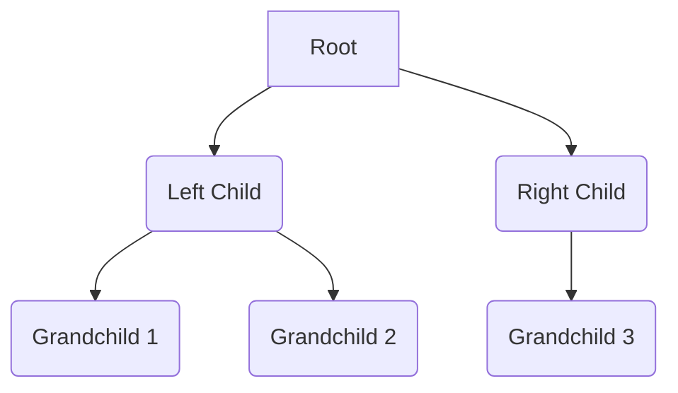
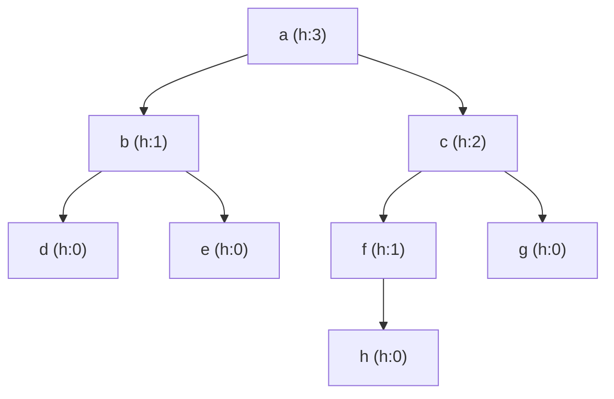

> [!NOTE] Table Of Contents
>
> Trees
> - Skew Tree
> - Binary Tree
>   - Strict Binary Tree
>   - Full Binary Tree
>   - Complete Binary Tree

---

> [!my-definition-callout] Tree
>
> A tree is a *hierarchical*, *non-linear* *data structure* or *abstract data type* that stores a collection of elements a way where,
> 
> - It has a special node called the root
> - Every node except the root has exactly one parent node

> [!NOTE] Key Points:
> 
> - *Hierarchical:* Elements are organized in a parent-child relationship, like a family tree.
> - *Non-linear:* Unlike lists or arrays, elements are not stored in a sequential order.
> - *Nodes:* Represent elements or data within the tree.
> - *Edges:* Represent the connections between nodes.
> - *Root:* The topmost node, the starting point of the tree.
> - *Leaves*: Nodes at the bottom of the tree with no children.



> [!NOTE] Key Terms in a Tree
>
> - *Root:* Node with No Parent
> - *Edge:* Link from Parent to child
> - *Leaf:* Node that has no child
> - *Sibling:* Nodes with same parent
> - *Ancestor and Descendant:* A node `p` is an ancestor of node `q` and `q` is a descendant of `p` if there exists a path from `root` to `q` and `p` appears on the path.
> - *depth:* length of a path from root node to given node is the depth of given node
> - *Level:* set of all nodes in a tree at a given depth
> - *height*
>   - of a node is the length of the longest path from that node to a _leaf_ node in its subtree.
>   - of a tree is height of it's root node
> - *Size* of a node is the number of descendants it has including itself



> [!my-definition-callout] Skew Trees
> 
> - If every node in a tree has only one child (except leaf nodes) then we call such trees *skew trees*.
> - If every node has only left child then we call them *left skew trees*.
> - Similarly , if every node has only right child then we call them *right skew trees*.

> [!my-definition-callout] Binary Tree
> 
> A tree is called Binary Tree if each and every node in the tree has at most 2 children
> 
> - An empty tree is also a binary tree

> [!my-definition-callout] Strict Binary Tree
> 
> Each node has exactly two children or no child at all. In other words, no node has only one child.
> 
> *Key Points:*
> 
> - Every internal node (non-leaf node) has exactly two children.
> - Leaf nodes have no children.
> 
> ```mermaid
> graph TD
>   A((A)) --> B((B))
>   A --> C((C))
>   B --> D((D))
>   B --> E((E))
> ```

> [!my-definition-callout] Full Binary Tree
>
> Strict Binary Tree with all leaf nodes being at same level
> (or)
> All nodes except the leaves have two children. All leaf nodes are at the same level.
> 
> *Key Points:*
> 
> - A full binary tree is a type of strict binary tree.
> - All internal nodes have two children.
> - All leaf nodes are at the same depth.
>
> ```mermaid
> graph TD
>   A((A)) --> B((B))
>   A --> C((C))
>   B --> D((D))
>   B --> E((E))
>   C --> F((F))
>   C --> G((G))
> ```

> [!my-definition-callout] Complete Binary Tree
> A binary tree in which all levels, except possibly the last, are completely filled, and all nodes in the last level are as far left as possible.
> 
> *Key Points:*
> 
> - Nodes are filled from left to right at each level.
> - The last level may or may not be full, but if it's not, the nodes are filled from left to right.
> 
> ```mermaid
> graph TD
>   A((A)) --> B((B))
>   A --> C((C))
>   B --> D((D))
>   B --> E((E))
>   C --> F((F))
> ```

> [!Attention] Operations on Binary Trees
>
> Basic Operations
> - *Inserting* an element into a tree
> - *Deleting* an element from a tree
> - *Searching* for an element
> - *Traversing* the tree
> 
> Auxiliary Operations
> - Finding the *size* of the tree
> - Finding the *height* of the tree
> - Finding the level which has maximum sum
> - Finding the *least common ancestor (LCA)* for a given pair of nodes, and many more.

> [!NOTE] Traversal
> 
> - Preorder (DLR) Traversal
>   - Process Node before either of subtrees
> - Inorder (LDR) Traversal
>   - Node is visited between subtrees
> - Postorder (LRD) Traversal
>   - Node is visited after both subtrees
> 
> *More Traversals:*
> - There is another traversal method which does not depend on the above orders and it is: *Level Order Traversal*


> [!missing]
> More to read
> 
> - Threaded Binary Tree Traversals (stack/queue – less traversals)
> - Expression trees
> - XOR
> - Binary Search Trees
> - Balanced BST
> - AVL (Adelson-Velskii and Landis) Trees
> - Other Trees

---
---

> [!Info]- References & MetaData Information
> 
> Created On: 14 February 2025
> 
> Status: #baby
> 
> Keywords: #DataStructures #Trees
> 
> Tags: [[4 Indexes/DSA - Narasimha Karumanchi|DSA - Narasimha Karumanchi]]

---
---

[//]: # (These are reference links used in the body of this note and get stripped out when the markdown processor does its job. There is no need to format nicely because it shouldn't be seen. Thanks SO - http://stackoverflow.com/questions/4823468/store-comments-in-markdown-syntax)