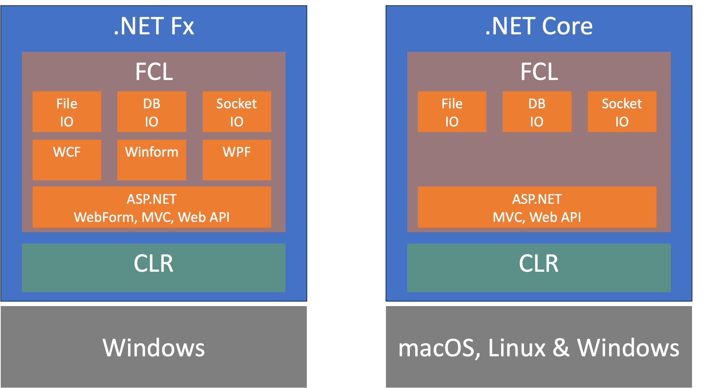

# Advent of .Net

## .NET Framework Milestones

1. **.NET Framework 1.0 (2002)**:
   - Introduced managed programming with the Common Language Runtime (CLR) and Framework Class Library (FCL).
   - Unified language for GUI and web development.

2. **.NET Framework 1.1 (2003)**:
   - Minor updates and improvements.

3. **.NET Framework 2.0 (2005)**:
   - Introduced generics, partial classes, and the `yield` keyword for iterators.

4. **.NET Framework 3.0 (2006)**:
   - Added Windows Presentation Foundation (WPF)
   - Windows Communication Foundation (WCF)
   - Windows Workflow Foundation (WF) and
   - Windows CardSpace

5. **.NET Framework 3.5 (2007)**:
   - Introduced Language Integrated Query (LINQ) which allowed querying of data directly within C# and Visual Basic.
   - Introduced extension methods.

6. **.NET Framework 4.0 (2010)**:
   - Added support for parallel programming with the Task Parallel Library (TPL) and the `dynamic` keyword.
   - Managed Extensibility Framework (MEF) and dynamic language runtime.

7. **.NET Framework 4.5 (2012)**:
   - Introduced `async` and `await` keywords for asynchronous programming.

8. **.NET Framework 4.8 (2019)**:
   - The final version of the .NET Framework, with various bug fixes and improvements.

## .NET Core and Beyond

1. **.NET Core 1.0 (2016)**:
   - A cross-platform, open-source version of .NET, supporting Windows, Linux, and macOS.
   - It also comes with managed programming via Common Language Runtime (CLR) and Framework Class Library (FCL).

2. **.NET Core 2.0 (2017)**:
   - Enhanced performance and added more APIs, making it easier to port code from the .NET Framework.

3. **.NET Core 3.0 (2019)**:
   - Added support for Windows desktop applications (WPF and Windows Forms) and significant performance improvements.

4. **.NET 5 (2020)**:
   - Unified .NET Framework and .NET Core into a single platform, simplifying the development process.

5. **.NET 6 (2021)**:
   - Continued the unification effort, bringing further performance enhancements, new APIs, and improved support for cloud, mobile, and IoT applications.

6. **.NET 7 (2022)**:
   - Focused on improving developer productivity, performance, and expanding platform support.

7. **.NET 8 (2023)**:
   - Introduced new features for cloud-native development, enhanced security, and further performance optimizations.

---

---

## References

- .Net Framework Version History - [*Wikipedia*][.Net Framework Version History]
- Evolution of .Net Core - [*machineminds*][Evolution of .Net Core]
- Understanding .Net versions - [*toxigon*][Understanding .Net versions]

[//]: Comments
  [.Net Framework Version History]: <https://en.wikipedia.org/wiki/.NET_Framework_version_history>
  [Evolution of .Net Core]: <https://machineminds.co/2021/04/08/the-evolution-of-net-a-comprehensive-overview-of-microsofts-cross-platform-development-framework/>
  [Understanding .Net versions]: <https://toxigon.com/understanding-dotnet-versions>
